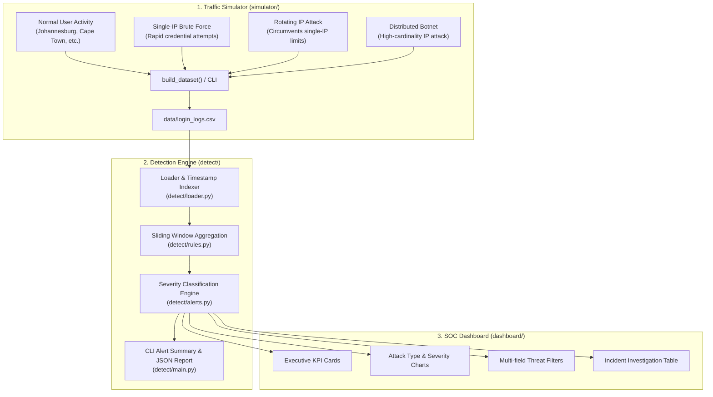

# Sentinel: Cyber Threat Simulation & SOC Detection Platform

[](https://www.python.org/)
[](file:///home/letlotlo/Desktop/Sentinel/tests)
[](file:///home/letlotlo/Desktop/Sentinel/dashboard/app.py)
[](file:///home/letlotlo/Desktop/Sentinel/LICENSE)

**Sentinel** is an end-to-end cybersecurity intelligence and monitoring platform. It generates synthetic enterprise authentication telemetry, injects multi-vector adversarial attacks, analyzes traffic using rolling-window detection algorithms, and streams prioritised security alerts directly into an interactive Security Operations Center (SOC) dashboard.

---

## 🏛️ Architecture Overview

Sentinel connects telemetry simulation, rule-based behavioral detection, and SOC visualization into a modular pipeline:



---

## ✨ Key Features

- **Adversarial Attack Simulation**:
  - **Single-IP Brute Force**: Repeated failed logins from a single origin within a tight time window.
  - **Rotating IP Attack**: Coordinated attack alternating between an attacker proxy pool to bypass basic IP rate limiting.
  - **Distributed Botnet Attack**: Large-scale distributed attack generating disparate source IPs against target identities.
- **Realistic Telemetry & Geolocation**:
  - Simulates authentic User Agents (Chrome, Firefox, Safari, Edge) and geographic origin mapping.
  - Dynamic dataset generation with configurable normal-to-attack ratios.
- **Rolling-Window Threat Detection**:
  - Utilises sliding temporal windows (`pandas.rolling`) to identify frequency bursts rather than naive static counts.
  - Separate heuristic thresholds per attack pattern (IP-level vs. username-level clustering).
- **Severity Scoring Engine**:
  - Categorizes threat levels into `HIGH`, `MEDIUM`, and `LOW` based on velocity and attack type.
- **Interactive SOC Dashboard**:
  - Built with Streamlit for real-time visualisation of threats.
  - Interactive metrics, attack type distributions, severity charts, and faceted filtering (severity, username, IP).
- **Comprehensive Test Suite**:
  - 27 unit and integration tests across data generators, detection heuristics, and CLI interfaces.

---

## 📁 Repository Structure

```text
Sentinel/
├── data/
│   └── login_logs.csv           # Generated telemetry dataset
├── simulator/                   # Log generation & attack simulation
│   ├── attacks.py               # Brute force, rotating IP, distributed botnet generators
│   ├── normal_activity.py       # Baseline user login simulation
│   ├── utils.py                 # IP generation, timestamping & GeoIP resolution
│   └── main.py                  # Simulator CLI & dataset compiler
├── detect/                      # Threat detection & alerting engine
│   ├── loader.py                # CSV ingestion & timestamp indexing
│   ├── rules.py                 # Sliding window detection algorithms
│   ├── alerts.py                # Severity scoring & alert formatting
│   └── main.py                  # Detection CLI & formatted threat reporting
├── dashboard/                   # Streamlit SOC Dashboard
│   ├── app.py                   # Streamlit application entrypoint
│   └── components/              # Metrics, charts, table & filters
├── tests/                       # Pytest test suite (27 tests)
│   ├── simulator/               # Simulator unit tests
│   └── detect/                  # Detection & pipeline integration tests
├── pytest.ini                   # Pytest configuration
├── requirements.txt             # Project dependencies
└── README.md                    # Project documentation
```

---

## 🚀 Quickstart Guide

### 1. Installation

Clone the repository and set up a virtual environment:

```bash
git clone https://github.com/letlotlo-modiba/Sentinel.git
cd Sentinel

# Create and activate virtual environment
python3 -m venv venv
source venv/bin/activate

# Install dependencies
pip install -r requirements.txt
```

### 2. Generate Authentication Telemetry

Run the simulator with default parameters (120 normal logs + all 3 attack vectors):

```bash
python3 -m simulator.main
```

#### Simulator CLI Options:

```bash
# Customise normal activity count, attack types, and target user
python3 -m simulator.main --normal-count 200 --attacks brute_force rotating --user admin --output ./data/login_logs.csv

# Flags:
#   -n, --normal-count   Number of normal events to generate (default: 120)
#   -a, --attacks        Attacks to inject (brute_force, rotating, distributed, all, none)
#   -o, --output         Target CSV file path (default: ./data/login_logs.csv)
#   -u, --user           Target victim username (default: admin)
```

> **Note**: Parent directories are created automatically if they do not exist.

### 3. Run the Threat Detection Engine

Execute the detection rules directly from the command line:

```bash
python3 -m detect.main
```

Output:
```text
=================================================================
           SENTINEL THREAT DETECTION REPORT
=================================================================
Total Alerts: 82 | HIGH: 36 | MEDIUM: 46 | LOW: 0
-----------------------------------------------------------------
[MEDIUM] BRUTE_FORCE          | User: N/A        | IP: 185.220.101.5   | 2026-09-30 22:48:10
[MEDIUM] ROTATING_ATTACK      | User: admin      | IP: Multiple / N/A  | 2026-09-30 22:48:10
[HIGH  ] DISTRIBUTED_ATTACK   | User: admin      | IP: Multiple / N/A  | 2026-09-30 22:48:10
=================================================================
```

#### Output Raw JSON:
```bash
python3 -m detect.main --json
```

#### Custom Thresholds:
```bash
python3 -m detect.main --threshold-bf 5 --threshold-rotating 10 --threshold-distributed 15
```

### 4. Launch the Streamlit SOC Dashboard

Start the interactive web dashboard to monitor attacks visually:

```bash
streamlit run dashboard/app.py
```

Open `http://localhost:8501` in your browser. The dashboard provides:
- **Executive Metrics**: Total active alerts with breakdown by severity (`HIGH`, `MEDIUM`, `LOW`).
- **Visual Analytics**: Attack breakdown by category and severity distribution bar charts.
- **Investigation Filter**: Slice data by alert severity, target username, and IP address.
- **Incident Audit Table**: Drill into incident timestamps, attacker IPs, and threat types.


## 🔍 Detection Rules Logic

| Attack Vector | Detection Grouping | Default Window | Default Threshold | Severity Classification |
|---|---|---|---|---|
| **Brute Force** | By IP Address | 2 Minutes | > 10 Failed Logins | Count > 15: `HIGH`<br>Count ≤ 15: `MEDIUM` |
| **Rotating IP Attack** | By Target Username | 3 Minutes | > 12 Failed Logins | Count > 10: `MEDIUM`<br>Count ≤ 10: `LOW` |
| **Distributed Attack** | By Target Username | 5 Minutes | > 20 Failed Logins | Count > 20: `HIGH`<br>Count ≤ 20: `MEDIUM` |


## 📄 License

This project is licensed under the MIT License

Verification Code: WTC-GPYE8WZ5